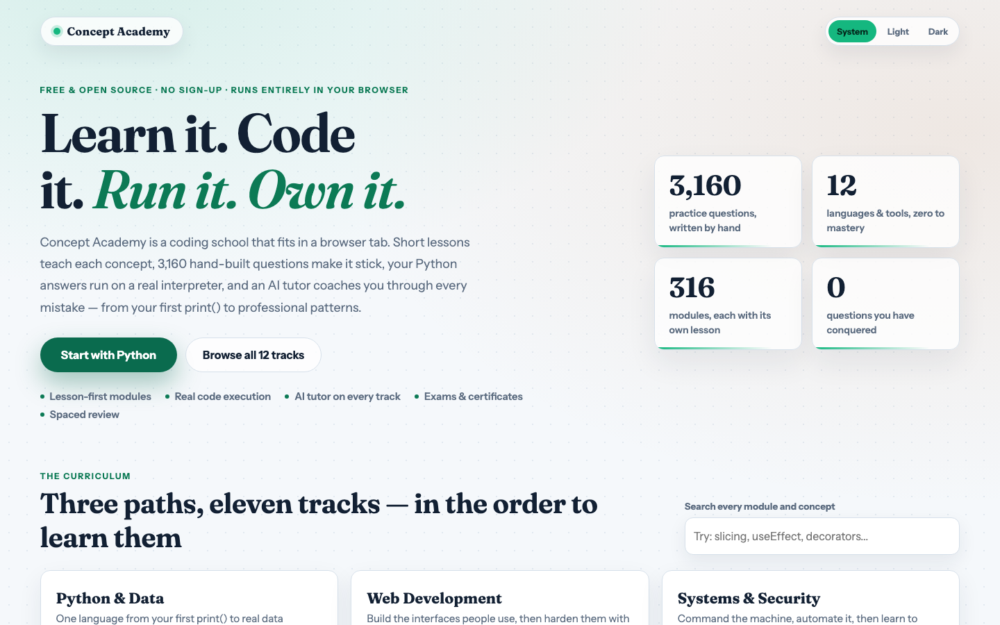
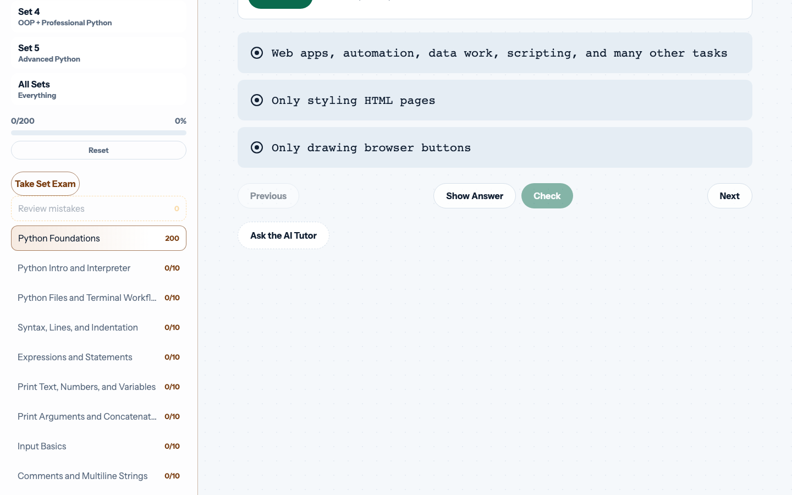
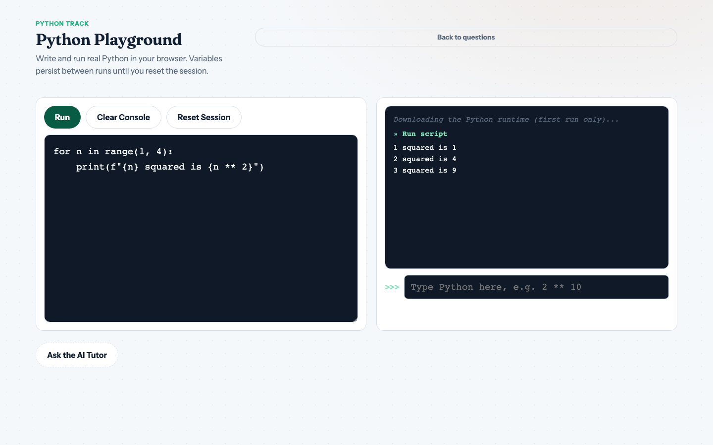
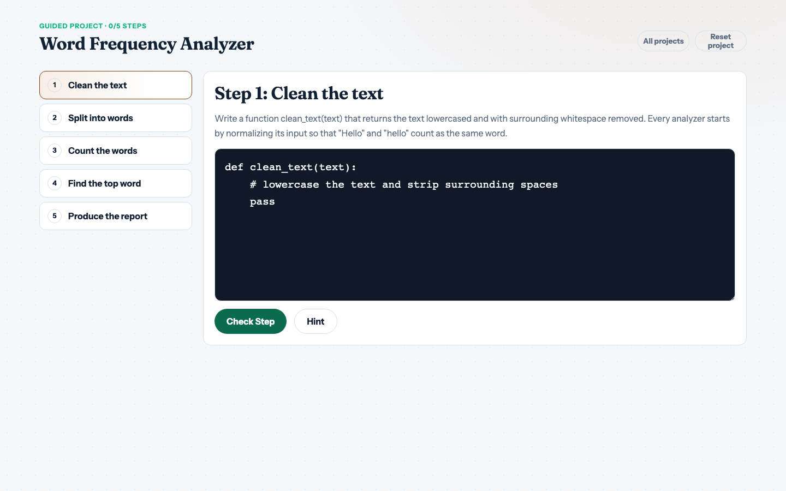
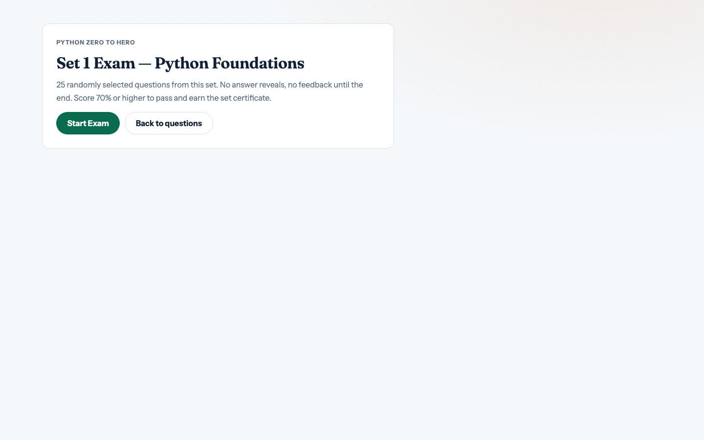
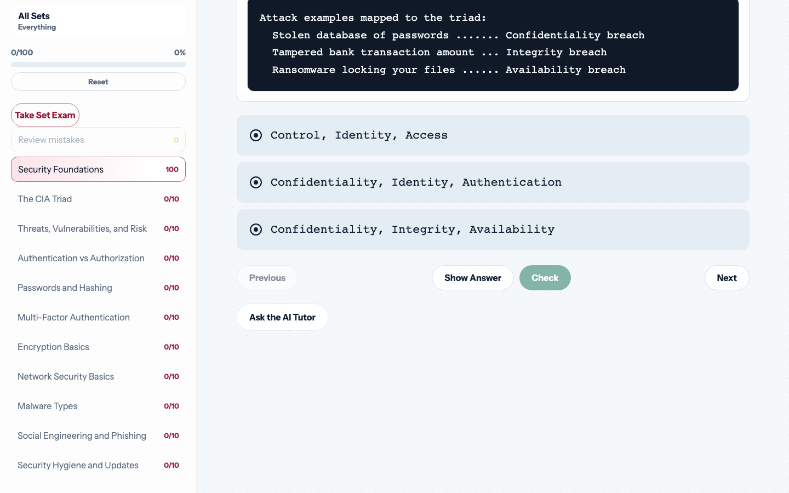

<div align="center">

# 🎓 Concept Academy

### Learn to code from zero to mastery — lessons, real code execution, and an AI tutor, all in your browser.


An open-source W3Schools/LabEx-style teaching platform: **2,900+ questions across 12 tracks**, module lessons, **real Python running in the browser**, step-verified projects, exams with printable certificates, spaced-repetition review, and a Socratic AI tutor. **No backend, no accounts** — everything runs client-side.

</div>

---

## 💡 What this does

Most quiz sites test you without teaching you, and grade code by string-matching — so wrong code passes and correct code fails. Concept Academy fixes both:

- 📖 **Every module teaches first** — a short lesson with key points and a runnable example sits above the questions.
- ⚡ **Python answers are *executed*, not pattern-matched.** Your code runs in a real interpreter (Pyodide); its output is compared against the reference solution's output, or hidden tests verify your functions. Any correct approach passes. Broken code that merely "looks right" fails.
- 🧠 **Progress is honest.** Multiple-choice options shuffle per question, revealed answers earn no credit, and missed questions resurface on a Leitner review schedule until you truly know them.

> 🟢 Answer a code question any valid way — `while` loop, `for` loop, comprehension — execution grading accepts it.
>
> 🟡 Peek at an answer? It's marked *revealed* and returns in your review queue.
>
> 🔴 Paste-the-keywords cheese? It doesn't run, so it doesn't pass.

---

## 📸 Screenshots

| Landing | Lesson + Quiz | Playground |
| :---: | :---: | :---: |
|  |  |  |

| Guided Projects | Set Exams | Multi-language |
| :---: | :---: | :---: |
|  |  |  |

---

## 🗺️ Live tracks

| Track | Content | Code execution |
| --- | --- | :---: |
| 🐍 **Python** | 5 sets · 92 modules · 920 questions — files & syntax through OOP, async, itertools, typing, performance, packaging | ✅ Pyodide |
| ⚛️ **React** | 6 sets · 94 modules · 940 questions — JSX to hooks, routing, server state, architecture, React 19 (Actions, use(), Server Components) | ✅ Babel + React |
| 🗄️ **SQL** | 2 sets · 20 modules · 200 questions — SELECT to window functions, transactions, indexes, schema design | ✅ sql.js |
| 🔷 **TypeScript** | 10 modules · 100 questions — annotations to narrowing, generics, strict mode | ✅ Babel |
| 💲 **Bash** | 10 modules · 100 questions — navigation to pipes, scripts, permissions | — |
| 🐧 **Linux** | 10 modules · 100 questions — filesystem to systemd, networking, logs | — |
| 🐳 **Docker** | 10 modules · 100 questions — containers vs VMs to Dockerfiles, volumes, Compose, multi-stage builds | — |
| 🛡️ **Cybersecurity** | 3 sets · 30 modules · 300 questions — CIA triad & crypto to web defense, OWASP, threat modeling, blue team, forensics, ethics | — |
| 💛 **jQuery** | 10 modules · 100 questions — selectors to AJAX, plus vanilla-JS migration | ✅ live playground |
| 🔢 **NumPy** | 10 modules · 100 questions — arrays to broadcasting, masking, views vs copies | ✅ Pyodide |
| 🐼 **Pandas** | 10 modules · 100 questions — DataFrames to groupby, merging, cleanup | ✅ Pyodide |
| 📊 **Matplotlib** | 10 modules · 100 questions — figures to subplots, chart literacy | — |

**Every one of the 316 modules ships with a lesson** (summary, key points, runnable/read-along example) shown before its questions. Every track gets the **AI tutor**, **review queue**, **exams**, and **search**.

---

## ✨ Features

- 🗺️ **Learning paths** — the library is a curriculum, not a grid: three ordered paths (Python & Data, Web Development, Systems & Security) tell you what to take next and show your progress per track
- 📖 **Lessons before questions** — W3Schools-style "learn, then try", with a real interpreter behind Python examples
- ⚡ **Execution-based grading** — Python/NumPy/Pandas run in Pyodide (output comparison + hidden tests); **SQL runs in a real in-browser SQLite (sql.js)** and is graded by comparing result sets; **React/TS/jQuery compile with Babel and run live** — JSX answers are graded by comparing what they actually render
- 🐍 **Python playground** — editor, console, and REPL with persistent session and `input()` support
- 🛠️ **Guided projects** — LabEx-style multi-step builds (word analyzer, bank account, JSON grade book), each step verified by running your code against hidden tests
- 🔁 **Review queue** — wrong/revealed answers resurface on a 3-stage Leitner schedule
- 🏆 **Exams + certificates** — 25 sampled questions, no reveals, 70% to pass, printable certificate
- 🤖 **AI tutor** — sees your question, attempt, and run output; hints before answers; escalates when you're stuck twice ([free OpenRouter key](https://openrouter.ai/keys), stored only in your browser)
- 🔎 **Concept search** — find any module across all 2,900+ questions from the landing page
- ▶️ **Resume** — continue exactly where you left off
- 🌗 **Light / dark / system themes**
- 🛡️ **Honest scoring** — seeded choice shuffling, no credit for revealed answers, attempt tracking

---

## 🚀 Quick start

```bash
git clone https://github.com/thegreatLUCY/Concept-academy.git
cd Concept-academy
npm install
npm run dev      # → http://localhost:5173
```

| Command | What it does |
| --- | --- |
| `npm run dev` | Start the dev server |
| `npm run build` | Production build |
| `npm run audit` | Validate all 3,160 questions, lessons, and projects |
| `node scripts/screenshots.mjs` | Regenerate README screenshots (needs dev server + Playwright) |

> First Python execution downloads the Pyodide runtime (~10 MB) from CDN, then it's cached.

---

## 🏗️ Project structure

```
src/
  App.jsx                  # tracks registry, quiz engine, progress, review, search
  components/              # QuestionBody, ExamMode, ProjectsView, PythonPlayground, AiTutor
  lib/                     # pyodideRunner, pythonGrader (execution grading), shuffle
  data/                    # 22 question sets, 296 lessons (100% coverage), 3 guided projects
scripts/
  audit-data.mjs           # structural + balance audit (runs in CI)
  screenshots.mjs          # Playwright capture for this README
.github/workflows/ci.yml   # audit + build on every push/PR
```

---

## 🤝 Contributing

Content is the most valuable contribution — questions, lessons, projects, new tracks. The data formats and authoring rules (difficulty ramps, trap questions, balance requirements) are documented in [CONTRIBUTING.md](CONTRIBUTING.md). `npm run audit` must pass; CI enforces it.

## 🧭 Roadmap

- Guided projects for every track
- Full spaced-repetition scheduling

## 📄 License

[MIT](LICENSE) — free to use, learn from, and build on.
